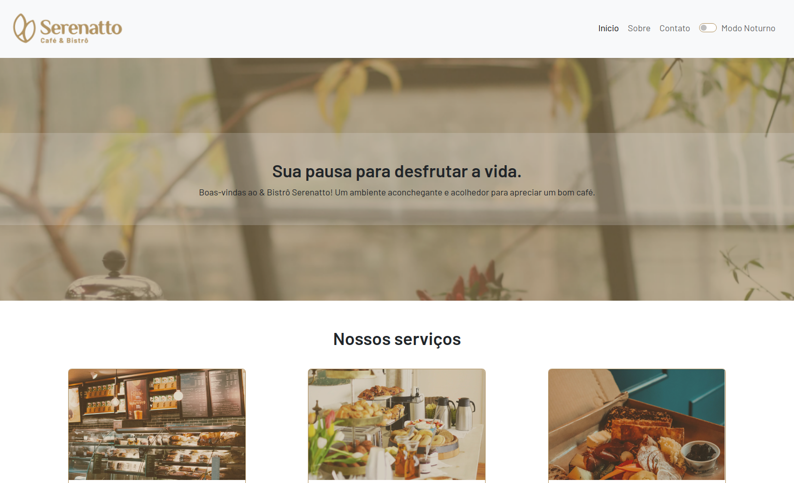

# Serenatto

Landing Page de cafeteria e bistrô fictício, desenvolvido utilizando os recursos do Bootstrap 5, aproveitando ao máximo suas classes e componentes para garantir uma experiência responsiva e visualmente atrativa em diferentes dispositivos, desde desktops até smartphones. Navegue por ele clicando [aqui](). 

## Imagens

## Objetivo

- Aprender o uso do Bootstrap;
- Treinar o uso de atributos relacionados a acessibilidade.

## Funcionalidade

- Possui acessibilidade;
- Acessível que diversos dispositivosd.

## Tecnologias utilizadas

* HTML;
* CSS;
* Boostrap;
* Javascript.